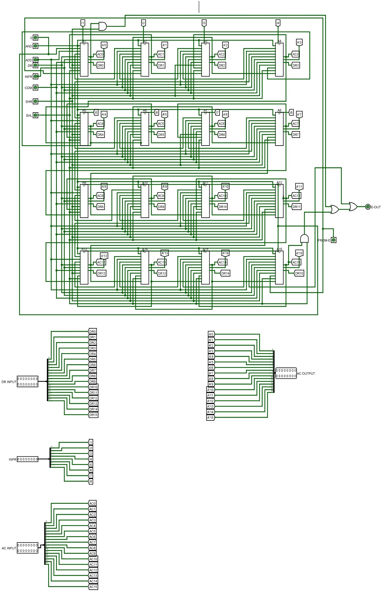
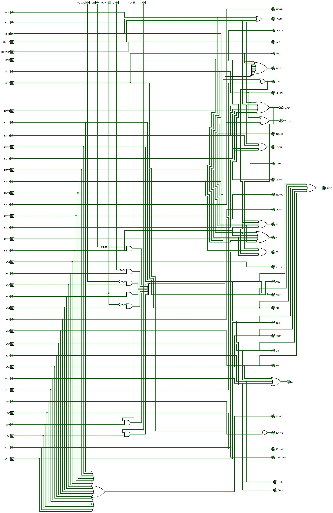
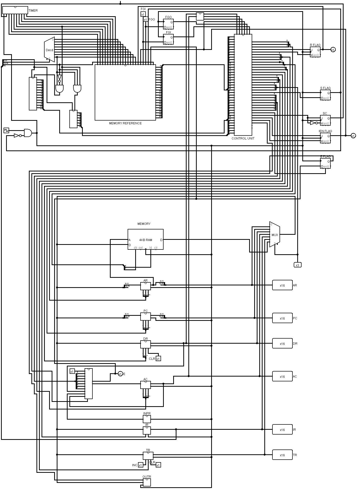

## Introduction
This repository contains the documentation and simulation files for a simplified processor model called Basic Computer. The Basic Computer is designed to help understand how processors work and the fundamental principles of computer organization and architecture.
## 
###### Hardware Components
The Basic Computer comprises the following hardware components:

&rarr; *Memory Unit:* 4096 words of 16 bits each.

&rarr; *Registers:* Address Register (AR), Program Counter (PC), Data Register (DR), Accumulator (AC), Instruction Register (IR), Temporary Register (TR), Input Register (INPR), and Output Register (OUTR).

&rarr;*Flip-flops:* Seven flip-flops for various control purposes.

&rarr;*Decoders:* Two decoders, a 3 x 8 decoder for opcode decoding and a 4 x 16 timing decoder for Sequence Counter (SC).

&rarr;*Common Bus System:* A 16-bit common bus for data transfer.

&rarr;*Control Logic Gates:* Combinational circuits for controlling various operations.

&rarr;*Arithmetic and Logic Unit (ALU):* Capable of performing operations like AND, ADD, Complement, Shift LEFT, Shift RIGHT, etc.

&rarr;Clock: A common clock for synchronizing operations.

&rarr;Memory / RAM: The memory unit is a 4096 X 16 RAM chip where instructions and data are stored during program execution. Instructions are stored consecutively for efficient program execution.
## 
###### Computer Registers
The computer uses eight registers, each serving a specific purpose, including storing addresses, data, instructions, and input/output characters.

&rarr; *Address Register (AR):* 12 bits, holds memory addresses.

&rarr; *Program Counter (PC):* 12 bits, holds the address of the current instruction.

&rarr; *Data Register (DR):* 16 bits, holds data read from memory.

&rarr; *Accumulator (AC):* 16 bits, holds data from ALU operations.

&rarr; *Instruction Register (IR):* 16 bits, holds the instruction code.

&rarr; *Temporary Register (TR):* 16 bits, holds temporary data.

&rarr; *Input Register (INPR):* 8 bits, holds input characters.

&rarr; *Output Register (OUTR):* 8 bits, holds output characters.
## 
###### Common Bus System
The common bus system facilitates efficient data transfer between registers and memory. It operates using selection lines S0, S1, and S2.

###### Arithmetic and Logic Unit (ALU)
The ALU performs mathematical operations on binary numbers, working bit by bit. It can handle operations like AND, ADD, Complement, Shift LEFT, Shift RIGHT, etc.

###### Common Clock
A common clock synchronizes all calculations and operations within the computer, measured in hertz (Hz).

###### Instruction Code
Instructions are sets of codes specifying operations, operands, and the processing sequence. An instruction code comprises fields like Mode, Opcode, and Address.

###### Modes in Instruction
There are two types of modes in the instruction code:

* Direct Addressing
* Indirect Addressing
##
###### Types of Instructions
The Basic Computer has three instruction code formats:

##### Memory-Reference Instructions 
These instructions include operations like AND, ADD, LDA, STA, BUN, BSA, and ISZ. Each operation is associated with specific micro-operations.

* ##### Register-Reference Instructions
There are 12 register-reference instructions, including CLA, CLE, CMA, CME, CIR, CIL, INC, SPA, SNA, SZA, SZE, and HLT. Each instruction is characterized by specific micro-operations affecting the Accumulator (AC) and other registers.

* ##### Input/Output Reference Instructions
These instructions involve input/output operations, including INP, OUT, SKI, SKO, ION, and IOF. They interact with Input and Output registers, as well as interrupt-related flags.
## 
###### Time and Control Unit
The Time Unit performs micro-operations at each clock pulse, and the Control Unit manages instruction execution. Flags like E, I, S, R, IEN, FGI, and FGO are used for specific purposes.

###### Instruction Cycle
The Basic Computer follows an instruction cycle for each program residing in memory. The cycle involves fetching, decoding, reading effective addresses, and executing instructions.

###### Interrupt Cycle
An interrupt cycle is initiated when the interrupt flip-flop R is set to 1. This occurs when an interrupt is enabled (IEN = 1) and either FGI or FGO flags are set. The interrupt cycle involves saving the return address and branching to handle the interrupt. 
##
#### Using Logisim
Logisim is employed to simulate and visualize the functionality of the Basic Computer. It provides an intuitive toolbar interface and supports the design of digital logic circuits.

#### Instructions for Simulation
&rarr; Open Logisim.

&rarr; Load the provided circuit file (Main.circ).

&rarr; Simulate the circuit to observe the Basic Computer's behavior.
##
### _Here is a view of Arithematic and Logic Unit of My Basic Computer_

##
### _Here is a view of Control Unit of My Basic Computer_

##
### _Here is a view of My Basic Computer_

