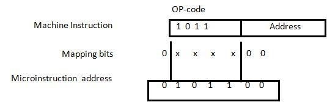
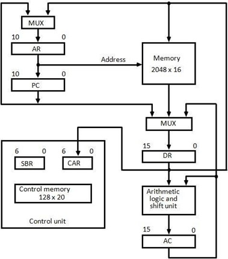
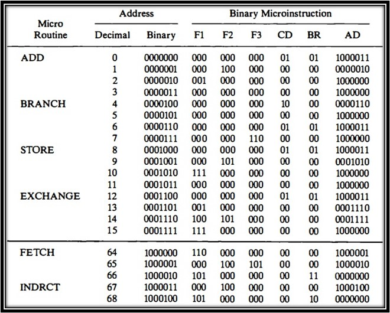
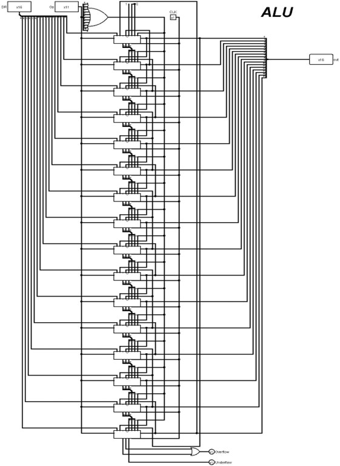
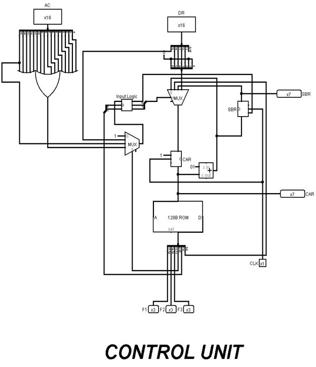
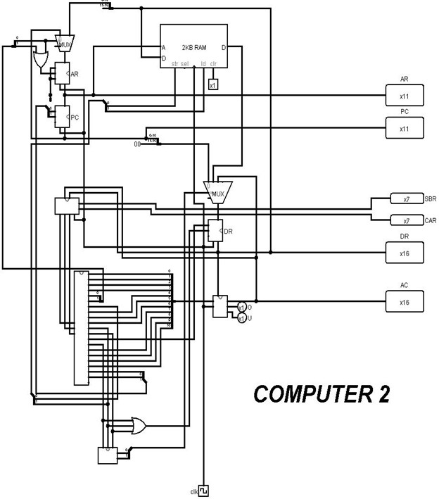

# Microprogrammed Control System

## Overview

Microprogrammed Control System for digital computers, offering an elegant alternative to hardwired control units.

## Key Components

### 1. Microoperations

Detailed low-level instructions (micro-ops) for CPU to implement complex machine instructions.

### 2. Micro Instruction

Symbolic microprogram translated into binary, with fields like label, microoperations, CD, BR, and AD.

### 3. Control Unit Organization

Configured using a block diagram, assuming a ROM for permanent storage of control information.

### 4. Address Sequencing

Steps during a computer instruction execution:

- **Step-1:** Load initial address.
- **Step-2:** Determine operand's effective address.
- **Step-3:** Generate microoperations based on instruction code.
- **Step-4:** Execute instruction and return to the fetch routine.

### 5. Mapping of an Instruction

### 6. Computer Hardware

### 7. Instruction Format

1-bit indirect addressing, 4-bit opcode, and 11-bit address field.

Examples:

- **ADD:** Adds operand to AC.
- **BRANCH:** Branches if AC is negative.
- **STORE:** Transfers AC content to memory.
- **EXCHANGE:** Swaps data between AC and memory.

### 8. Micro-instruction Format

20 bits with F1, F2, F3, CD, BR, and AD fields.

### 9. Subroutines

- **FETCH AND DECODE:** AR <- PC, DR <- M[AR], PC++, Read, Increment PC, Read DR, Transfer to AR and CAR.
- **INDIRECT:** Read, Transfer to DR and return.
- **ADD:** Read EA to DR, AC += DR, NOP, Call Indirect, Read, Jump to Fetch.
- **STORE:** M[EA] <- AC, NOP, Call Indirect, AC to DR, Write, Jump to Fetch.
- **EXCHANGE:** M[EA] <-> AC, NOP, Call Indirect, Read, Transfer to DR and AC, Write, Jump to Fetch.
- **BRANCH:** If (AC < 0), PC <- EA, NOP, Jump to Fetch.

#### Using Logisim
Logisim is employed to simulate and visualize the functionality of the Basic Computer. It provides an intuitive toolbar interface and supports the design of digital logic circuits.

#### Instructions for Simulation
&rarr; Open Logisim.

&rarr; Load the provided circuit file (MAIN CIRCUIT.circ).

&rarr; Simulate the circuit to observe the Basic Computer's behavior.
##
### Here is a view of Arithematic and Logic Unit of My Microprogrammed Control Computer

##
### Here is a view of Control Unit of My Microprogrammed Control Computer

##
### Here is a view of My Microprogrammed Control Computer

## Contributors

- Shubham Dwivedi
- Shashvat Tiwari
- Vaibhav Mishra

## Acknowledgments

- Thanks to Dr. Alok Kumar (HOD, IT Department, UIET Kanpur) for helping through out working on this project.

